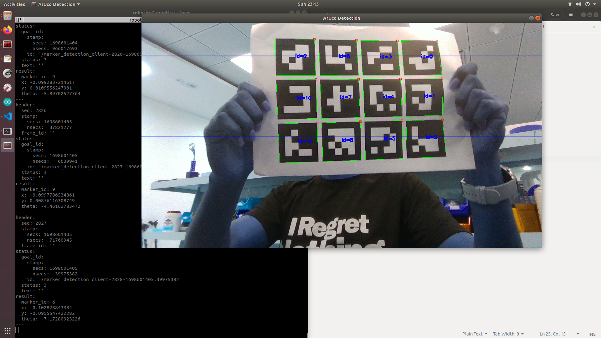

# Aruco_detection

Make sure the camera topic is published in ```/camera/color/image_raw```.

once it is done you can run the action server by,
```
rosrun detection_pkg detection_pkg_node
```
Then start the client,
```
rosrun detection_pkg action_client_node
```
to see the x,y,theta values check,
```
rostopic echo /marker_detection/result
```
## Output

